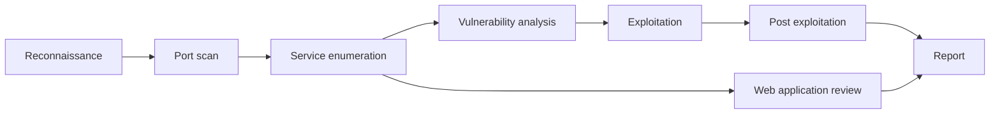
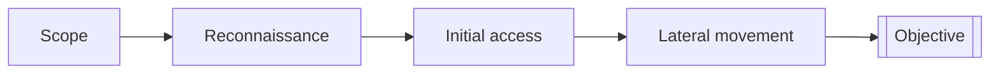
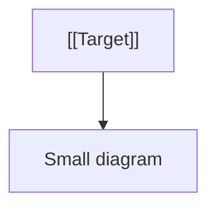

# Diagram

```mermaid
flowchart LR
  recon[Reconnaissance] --> scan[Port scan] --> enum[Service enumeration] --> vuln[Vulnerability analysis] --> exploit[Exploitation] --> post[Post exploitation] --> report[Report]
  enum --> web[Web application review] --> report
  click recon "[[Target]]"
  click report "Target.md#Second section"
```

A sheet-wide diagram:

```mermaid
flowchart LR
  scope[Scope] --> recon[Reconnaissance] --> access[Initial access] --> pivot[Lateral movement] --> goal[[Objective]]
  click access "[[Target]]"
```

```mermaid
flowchart TD
  A["[[Target]]"] --> B[Small diagram]
```
